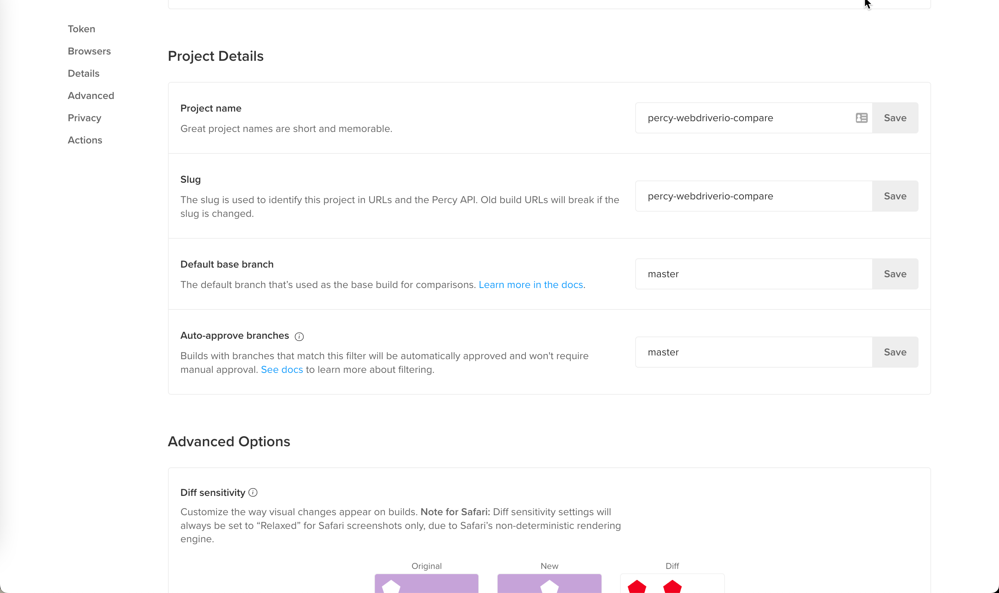
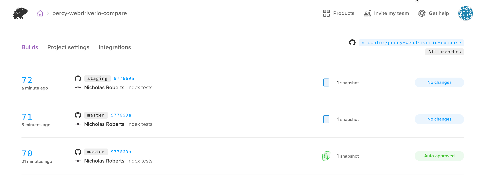
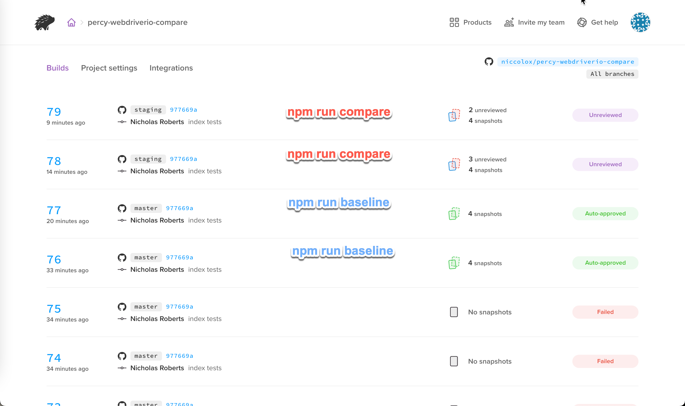
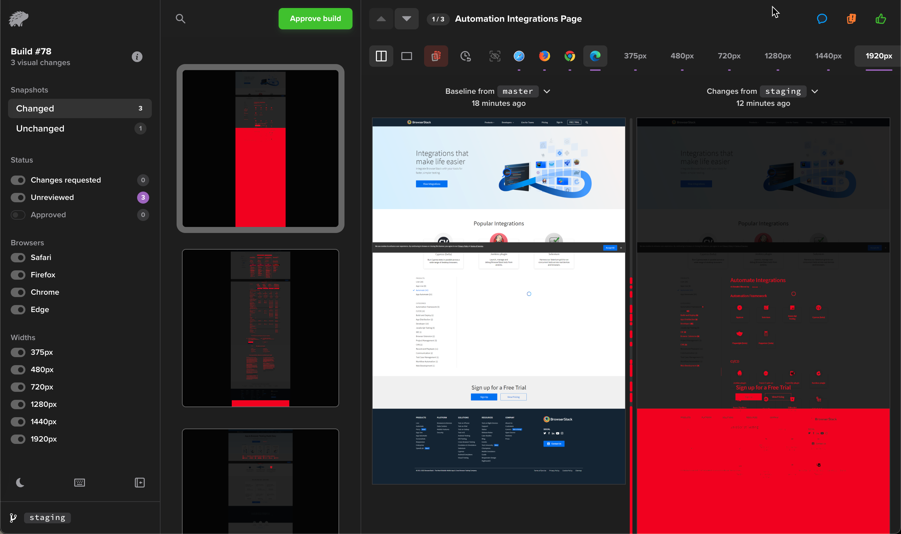

## Percy Visual Testing

Demo uses Percy.io Visual Testing platform and Webdriver.io to do the following

* uses ```npm run visual:baseline``` to buid a Percy visual baseline of Browserstack.com production website
* uses ```npm run visual:compare``` to Percy visual comparison of Browserstack staging site compared to the baseline of the production site
* Webdriver.io is used to drive Percy Snapshots
* some ideas on a DSL are sketched out

### Summary

```shell
npm install
npm run hello
npm run visual:baseline
npm run visual:compare
```

## Hello World Webdriver.io Percy

https://docs.percy.io/docs/webdriverio

```
export PERCY_TOKEN=
npm hello
npx percy exec -- wdio run ./wdio.conf.js --spec test/hello_world.test.js
```

```
nicholas@NicholasRoberts-RRWLP69JNW percy-webdriverio-compare % npx percy exec -- wdio run ./wdio.conf.js --spec test/hello_world.test.js
[percy] Percy has started!
[percy] Running "wdio run ./wdio.conf.js --spec test/hello_world.test.js"
2022-10-21T00:08:49.889Z WARN @wdio/config:ConfigParser: pattern ./test/one.test.js did not match any file

Execution of 1 workers started at 2022-10-21T00:08:49.897Z

[0-0] RUNNING in firefox - /test/hello_world.test.js
[percy] Snapshot taken: webdriver.io1
[0-0] PASSED in firefox - /test/hello_world.test.js

 "spec" Reporter:
------------------------------------------------------------------
[firefox 105.0.3 mac #0-0] Running: firefox (v105.0.3) on mac
[firefox 105.0.3 mac #0-0] Session ID: 96411d34-aa0f-49ab-8b28-84fc1ed8e6fe
[firefox 105.0.3 mac #0-0]
[firefox 105.0.3 mac #0-0] » /test/hello_world.test.js
[firefox 105.0.3 mac #0-0] webdriver.io page
[firefox 105.0.3 mac #0-0]    ✓ should have the right title
[firefox 105.0.3 mac #0-0]
[firefox 105.0.3 mac #0-0] 1 passing (3.2s)


Spec Files:      1 passed, 1 total (100% completed) in 00:00:05 

[percy] Finalized build #70: https://percy.io/3fdc3ca1/percy-webdriverio-compare/builds/22374556
```

image


# set master github branch as baseline
In project settings we select master branch as ```Default base branch```
Note, in this stage we are running local and not CICD so we wont be driving builds off branches.
https://percy.io/3fdc3ca1/percy-webdriverio-compare/settings



setting baseline 
```
PERCY_BRANCH=master npx percy exec -- wdio run ./wdio.conf.js --spec test/hello_world.test.js
```

patterned after docs
```
PERCY_BRANCH=production percy exec -- node snapshots.js
```


```
 PERCY_BRANCH=master npx percy exec -- wdio run ./wdio.conf.js --spec test/hello_world.test.js
[percy] Percy has started!
[percy] Running "wdio run ./wdio.conf.js --spec test/hello_world.test.js"
2022-10-21T00:21:14.620Z WARN @wdio/config:ConfigParser: pattern ./test/one.test.js did not match any file

Execution of 1 workers started at 2022-10-21T00:21:14.627Z

[0-0] RUNNING in firefox - /test/hello_world.test.js
[percy] Snapshot taken: webdriver.io1
[0-0] PASSED in firefox - /test/hello_world.test.js

 "spec" Reporter:
------------------------------------------------------------------
[firefox 105.0.3 mac #0-0] Running: firefox (v105.0.3) on mac
[firefox 105.0.3 mac #0-0] Session ID: f5ba21e5-b8ef-4ed6-abfe-1e42168b6891
[firefox 105.0.3 mac #0-0]
[firefox 105.0.3 mac #0-0] » /test/hello_world.test.js
[firefox 105.0.3 mac #0-0] webdriver.io page
[firefox 105.0.3 mac #0-0]    ✓ should have the right title
[firefox 105.0.3 mac #0-0]
[firefox 105.0.3 mac #0-0] 1 passing (2.6s)


Spec Files:      1 passed, 1 total (100% completed) in 00:00:04 

[percy] Finalized build #71: https://percy.io/3fdc3ca1/percy-webdriverio-compare/builds/22375291
```


compare staging to target baseline of production 

patterned after docs
```
PERCY_BRANCH=staging PERCY_TARGET_BRANCH=production percy exec -- node snapshots.js
```


```
PERCY_BRANCH=staging PERCY_TARGET_BRANCH=master npx percy exec -- wdio run ./wdio.conf.js --spec test/hello_world.test.js
```

```
PERCY_BRANCH=staging PERCY_TARGET_BRANCH=master npx percy exec -- wdio run ./wdio.conf.js --spec test/hello_world.test.js
[percy] Percy has started!
[percy] Running "wdio run ./wdio.conf.js --spec test/hello_world.test.js"
2022-10-21T00:28:27.696Z WARN @wdio/config:ConfigParser: pattern ./test/one.test.js did not match any file

Execution of 1 workers started at 2022-10-21T00:28:27.707Z

[0-0] RUNNING in firefox - /test/hello_world.test.js
[percy] Snapshot taken: webdriver.io1
[0-0] PASSED in firefox - /test/hello_world.test.js

 "spec" Reporter:
------------------------------------------------------------------
[firefox 105.0.3 mac #0-0] Running: firefox (v105.0.3) on mac
[firefox 105.0.3 mac #0-0] Session ID: 0a80f52b-547c-4a3c-b0ee-fe2504ed1b6d
[firefox 105.0.3 mac #0-0]
[firefox 105.0.3 mac #0-0] » /test/hello_world.test.js
[firefox 105.0.3 mac #0-0] webdriver.io page
[firefox 105.0.3 mac #0-0]    ✓ should have the right title
[firefox 105.0.3 mac #0-0]
[firefox 105.0.3 mac #0-0] 1 passing (2.4s)


Spec Files:      1 passed, 1 total (100% completed) in 00:00:04 

[percy] Finalized build #72: https://percy.io/3fdc3ca1/percy-webdriverio-compare/builds/22375429
```




NOTE: Personally, I find this document from Percy, and the entire getting started docs confusing and a boring wall of abstract text.


## User Experience Design


Baseline

```
PERCY_BRANCH=master npx percy exec -- wdio run ./wdio.conf.js --spec test/browserstack.production.test.js

percy-baseline -baseline https://www.browserstack.com -percy-branch master


```

## Compare 

```
npm run compare
```

pattern from docs
```shell
PERCY_BRANCH=staging PERCY_TARGET_BRANCH=production percy exec -- node snapshots.js
```

```shell
PERCY_BRANCH=staging PERCY_TARGET_BRANCH=master npx percy exec -- wdio run ./wdio.conf.js --spec test/browserstack.staging.test.js
```

psuedo
```
percy-compare -baseline https://www.browserstack.com -comparison https://k8.bsstag.com

```

CLI results
```
npm run compare

> @percy/webdriverio@2.0.2 compare
> PERCY_BRANCH=staging PERCY_TARGET_BRANCH=master npx percy exec -- wdio run ./wdio.conf.js --spec test/browserstack.staging.test.js

[percy] Percy has started!
[percy] Running "wdio run ./wdio.conf.js --spec test/browserstack.staging.test.js"

Execution of 1 workers started at 2022-10-21T02:13:04.117Z

[0-0] STAGING_URL
[0-0] https://k8s.bsstag.com
[0-0] RUNNING in firefox - /test/browserstack.staging.test.js
[percy] Snapshot taken: Homepage Page
[percy] Snapshot taken: Pricing Page
[percy] Snapshot taken: Automation Integrations Page
[percy] Snapshot taken: Docs Page
[0-0] PASSED in firefox - /test/browserstack.staging.test.js

 "spec" Reporter:
------------------------------------------------------------------
[firefox 105.0.3 mac #0-0] Running: firefox (v105.0.3) on mac
[firefox 105.0.3 mac #0-0] Session ID: ca993416-3dc5-4b49-a2a7-f738d96df49a
[firefox 105.0.3 mac #0-0]
[firefox 105.0.3 mac #0-0] » /test/browserstack.staging.test.js
[firefox 105.0.3 mac #0-0] Percy Staging
[firefox 105.0.3 mac #0-0]    ✓ snapshot homepage
[firefox 105.0.3 mac #0-0]    ✓ snapshot pricing
[firefox 105.0.3 mac #0-0]    ✓ snapshot integrations
[firefox 105.0.3 mac #0-0]    ✓ snapshot docs
[firefox 105.0.3 mac #0-0]
[firefox 105.0.3 mac #0-0] 4 passing (24.6s)


Spec Files:      1 passed, 1 total (100% completed) in 00:00:26 

[percy] Finalized build #79: https://percy.io/3fdc3ca1/percy-webdriverio-compare/builds/22378623
```

Build List

The Webdriver.io results succeed, however Percy list shows changes needing review and approval.



Percy Dashboard

Dashboard for Build shows items for review.

https://percy.io/3fdc3ca1/percy-webdriverio-compare/builds/22378453/changed/1247073283?browser=edge&browser_ids=18%2C30%2C31%2C32&subcategories=unreviewed%2Cchanges_requested&viewLayout=side-by-side&viewMode=new&width=1920&widths=375%2C480%2C720%2C1280%2C1440%2C1920




## Development Ideas

* want a command that allows you to pass arguments of baseline and comparison 

does both
```npm run visual:baseline
npm run visual compare
```

```
visualizer:baseline -baseline_url "https://www.browserstack.com"
visualizer:compare -baseline_url "https://www.browserstack.com" -comparison_url "https://k8.bcstag.com"
```

set in config 
* baseline url
* comparison url

thats it?